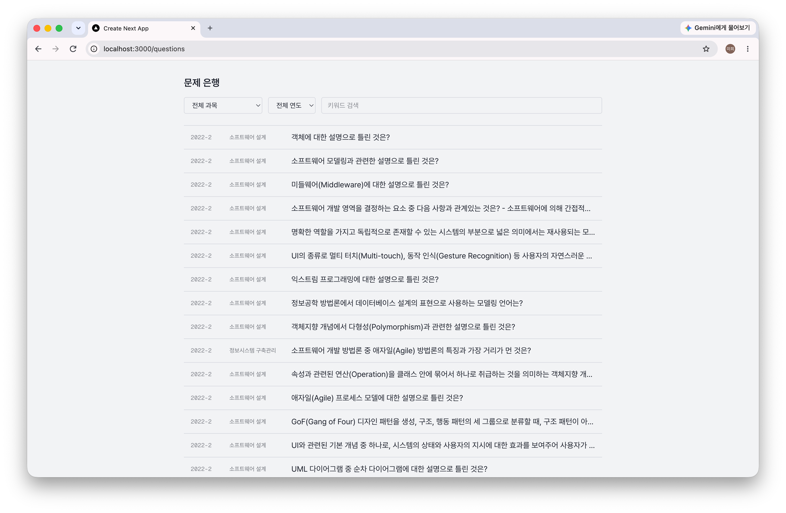
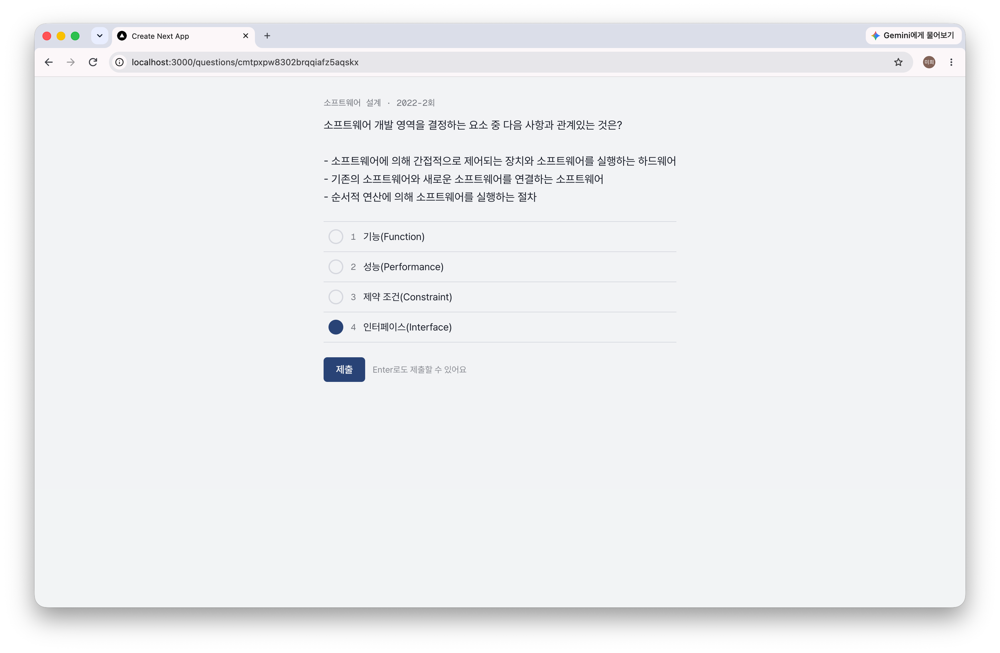
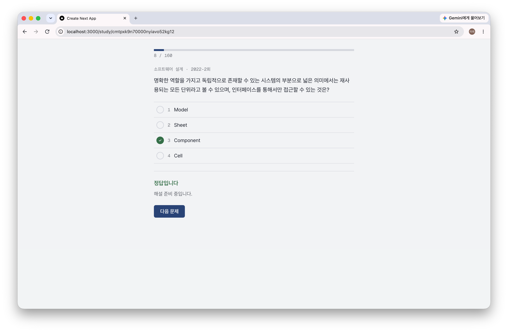

# 기출메이트 (GichulMate)

정보처리기사 필기 기출문제를 반복해서 풀고, 오답을 관리하고, 학습 통계를 확인할 수 있는 학습 서비스입니다.

## 배경

정보처리기사 필기를 합격하고 실기를 준비하는 과정에서, 기출문제를 효율적으로 반복 학습할 수 있는 개인 학습 도구가 필요해서 직접 만들었습니다. 시중 문제풀이 서비스는 광고가 많거나 오답 관리·통계 기능이 약한 경우가 많아, 실제로 제가 쓸 도구를 스스로 설계하고 데이터를 구축하는 것부터 시작했습니다.

## 기술 스택

| 영역 | 기술 | 선택 이유 |
| --- | --- | --- |
| 프레임워크 | Next.js 16 (App Router) | 서버/클라이언트 컴포넌트를 함께 활용, API 라우트로 백엔드까지 한 저장소에서 관리 |
| 언어 | TypeScript | 문제/보기/채점 로직처럼 타입 오류가 곧 데이터 오류로 이어지는 도메인이라 정적 타입이 특히 유용 |
| 스타일 | Tailwind CSS v4 | 별도 디자인 시스템 없이 빠르게 일관된 UI 구축 |
| 폰트 | Pretendard | 한글 가독성이 좋고, 필요한 weight만 self-host해서 번들 크기 최소화 |
| 서버 상태 관리 | TanStack Query v5 | 문제 목록/필터 결과 캐싱, 페이지네이션 |
| 클라이언트 상태 관리 | Zustand | 모의고사 타이머 등 로컬 상태 관리용 (2단계 CBT 모드에서 도입 예정) |
| DB | PostgreSQL (Supabase) | 과목-문제-보기-오답 등 관계형 데이터에 적합, 무료 티어로 시작 가능 |
| ORM | Prisma (v7, driver adapter 기반) | 스키마 관리·마이그레이션이 명확, seed 스크립트로 800문제 적재 |
| AI | Gemini API | PDF 페이지 이미지에서 문제/보기/정답을 구조화된 JSON으로 추출 |
| 테스트 | Vitest | 채점 로직 등 정답 판정이 중요한 로직 검증용 (설치 완료, 테스트 코드 작성 예정) |

## 핵심 기능 (1단계 완료)

### 문제 은행 조회

과목/연도/키워드로 필터링하고 페이지네이션으로 탐색합니다.



### 문제 풀이

OMR 마킹 방식으로 보기를 선택하고, 숫자키(1~4)와 Enter만으로 풀이·제출할 수 있습니다. 제출 후 정답/오답을 색상과 기호(✓/✗)로 이중 표시해 색각 이상 사용자도 구분할 수 있습니다.



### 과목별 학습 모드

과목 단위로 문제를 순서대로 풀고, 진행률과 완료 후 정답률을 확인합니다.



## 데이터 파이프라인

이 프로젝트에서 가장 공들인 부분입니다. 정형화되지 않은 PDF 해설집 8개 회차(800문제)를 실제 서비스에 쓸 수 있는 검증된 데이터로 바꾸는 과정 전체를 직접 설계·구현했습니다.

```
PDF 해설집 (8개 회차)
    │  pdftoppm으로 페이지 이미지 렌더링
    ▼
Gemini Vision 추출 (구조화된 JSON, 페이지 청크 단위)
    │  사람 검수 (정답표 자동 대조 포함)
    ▼
data/processed/*.json  →  Prisma seed  →  PostgreSQL (799문제)
```

### 재시도·재개 로직

Gemini API 무료 티어는 일일 요청 한도가 있어, 429(쿼터 초과)와 503(일시적 서버 과부하)을 구분해서 처리합니다. 503은 대기 후 재시도하고, 429는 즉시 중단하며 완료된 청크를 저장해두어, 다음 날 쿼터가 리셋되면 이어서 처리합니다.

### 청크 겹침으로 페이지 경계 문제 해결

PDF를 5페이지 단위로 나눠 처리하는데, 문제 하나가 정확히 페이지 경계에서 지문과 보기로 잘리는 경우가 있었습니다(실제로 한 회차의 26번 문항이 이렇게 누락됨). 청크를 1페이지씩 겹치도록 바꿔서, 경계에 걸친 문제도 최소 한 청크에서는 온전히 보이도록 해결했습니다.

### 정답표 자동 대조 검증

각 PDF 끝에 있는 공식 정답 그리드(1~100번 표)를 파싱해서, AI가 추출한 799문제의 정답을 전수 대조하는 스크립트(`scripts/verify-answers.ts`)를 만들었습니다. 이 검증으로 AI가 잘못 판단한 정답 오류를 4건 실제로 발견해 수정했습니다(예: 원문자 오독으로 보기 내용 자체가 틀리게 추출된 경우, 해설의 암묵적 추론을 놓쳐 정답을 비워둔 경우 등).

### 저작권 경계 설계

문제 지문·보기·정답은 국가기술자격 공식 시험 문제이지만, PDF 해설집의 해설 원문은 "DB 저장 금지"가 명시된 저작물입니다. 그래서 파이프라인 설계 단계부터 해설 텍스트는 아예 추출하지 않았고, DB의 `explanation` 필드는 의도적으로 비워둔 채 설계했습니다(5단계에서 AI가 직접 생성한 해설로 채울 예정).

## 개발 로드맵

| 단계 | 범위 | 상태 |
| --- | --- | --- |
| 0단계 | 기출문제 데이터 파이프라인, DB 스키마 확정, 800문제 seed | ✅ 완료 |
| 1단계 (MVP) | 문제 은행 조회, 과목별 학습 모드, 기본 해설 노출 | ✅ 완료 |
| 2단계 | CBT 모의고사 모드, 결과 리포트(과목별 과락 판정) | 🔄 진행 중 |
| 3단계 | 오답노트, 즐겨찾기 | 🔜 예정 |
| 4단계 | 학습 통계(정답률 차트, 캘린더 히트맵) | 🔜 예정 |
| 5단계 | AI 추가 해설 기능(캐시 포함) | 🔜 예정 |
| 6단계 (선택) | 계정 시스템, 간격 반복 복습 스케줄, 취약 유형 AI 코칭 | 🔜 예정 |
| 7단계 (향후) | 실기 문제풀이·AI 채점 | 🔜 예정 |

## 로컬 실행 방법

### 1. 시스템 의존성

데이터 추출 스크립트(`npm run data:extract`)는 PDF를 이미지로 렌더링하기 위해 `pdftoppm`(poppler)이 시스템에 설치되어 있어야 합니다. 앱 실행 자체(`npm run dev`)에는 필요 없습니다.

```bash
# macOS
brew install poppler

# Ubuntu/Debian
sudo apt-get install poppler-utils

# Windows
# https://github.com/oschwartz10612/poppler-windows 등에서 빌드된 바이너리를 받아 PATH에 추가
```

### 2. 설치 및 환경 변수

```bash
npm install
```

`.env` 파일에 아래 변수가 필요합니다 (값은 각자 발급/설정):

```
DATABASE_URL=      # Supabase Transaction pooler 연결 문자열
DIRECT_URL=        # Supabase Direct 연결 문자열 (마이그레이션·시드용)
GEMINI_API_KEY=    # Gemini API 키 (데이터 추출 스크립트에서만 사용)
```

### 3. DB 마이그레이션 및 시드

```bash
npx prisma migrate deploy
npx tsx prisma/seed.ts
```

### 4. 개발 서버 실행

```bash
npm run dev
```

### 기타 스크립트

```bash
npm run build                                        # 프로덕션 빌드
npm run test                                         # Vitest 실행
npm run data:extract -- data/raw/<파일명>.pdf         # PDF에서 문제 추출 (Gemini API 키 필요)
npx tsx scripts/verify-answers.ts <draft JSON 경로>   # 정답표 자동 대조 검증
```

## 라이선스 및 데이터 출처

- **문제/보기/정답**: 한국산업인력공단이 시행하는 국가기술자격(정보처리기사) 시험의 공식 기출문제로, 재사용에 법적 제약이 없습니다.
- **원본 자료 출처**: 기출문제 원본 PDF는 [comcbt.com](https://www.comcbt.com) 전자문제집 CBT의 기출문제 해설집을 사용했습니다. comcbt.com에 감사드립니다.
- **해설 미포함**: comcbt.com 해설집 원문은 "DB 저장 및 재배포 금지"가 명시되어 있어, 이 프로젝트는 해설 텍스트를 추출·저장하지 않았습니다. 원본 PDF(`data/raw/`)도 저장소에 커밋하지 않습니다(`.gitignore` 처리). DB의 해설(`explanation`)은 현재 비어 있으며, 추후 AI가 직접 생성한 별도 해설로 채울 예정입니다.
